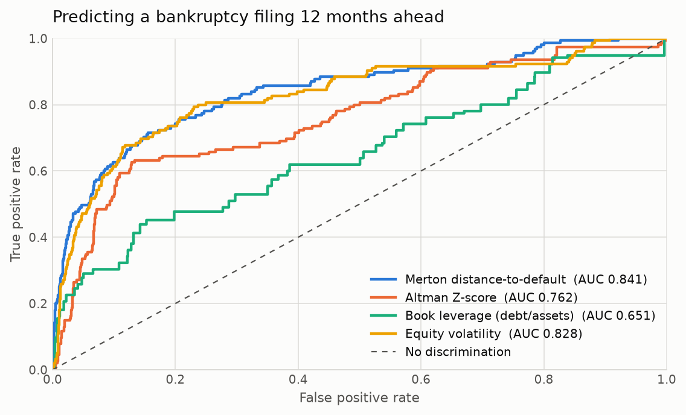
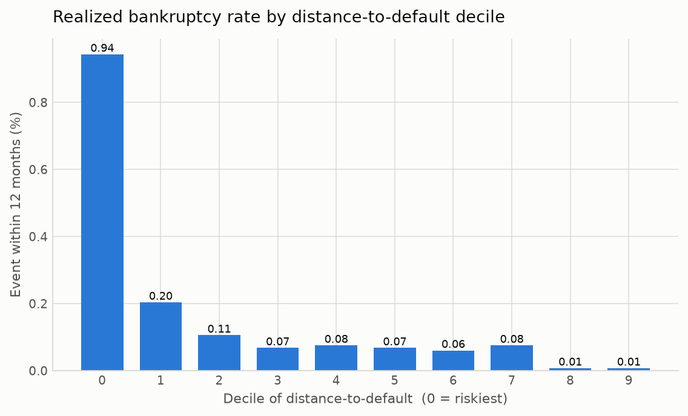
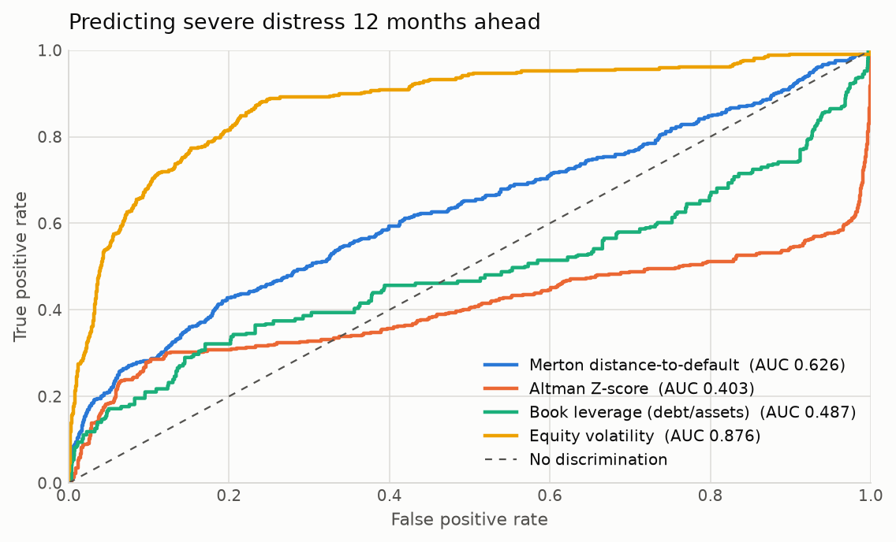
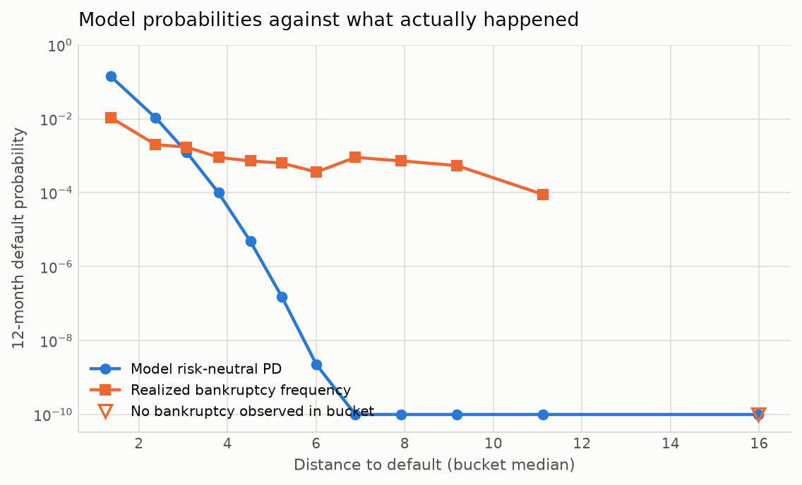
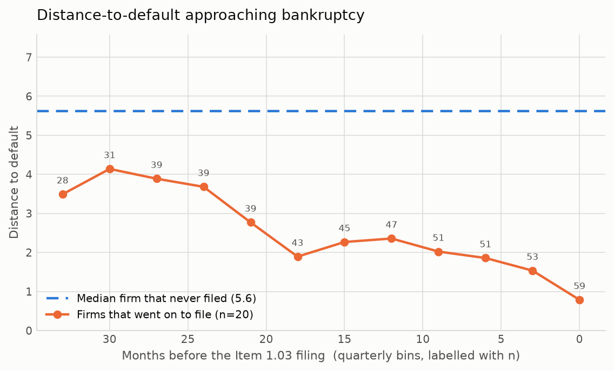
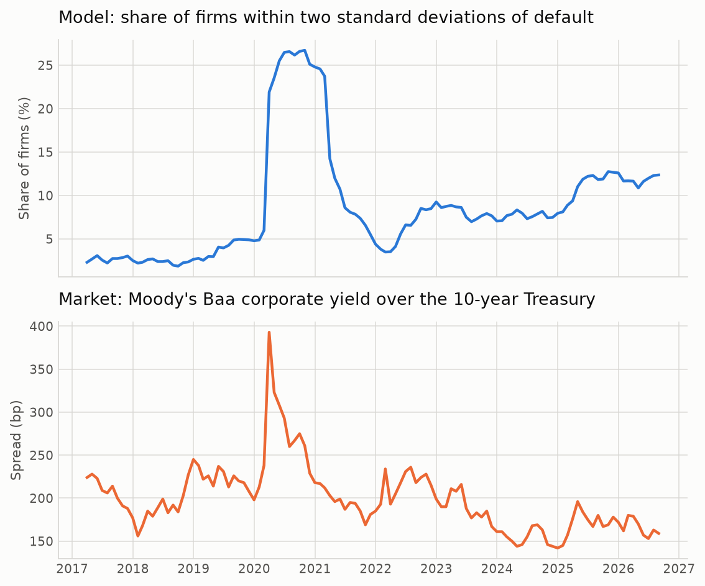
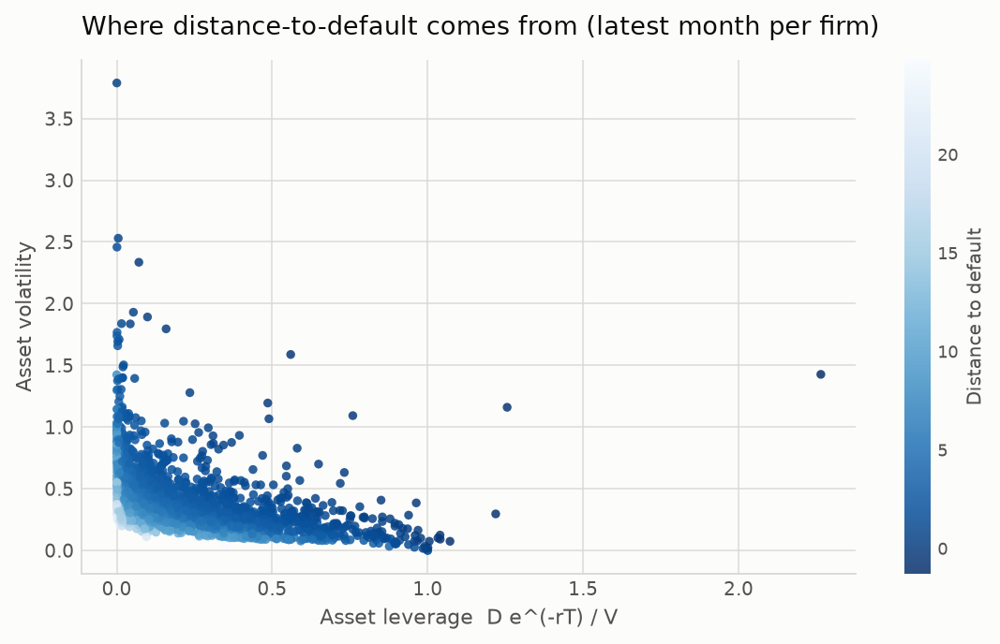

# Results

Generated by `scripts/run_analysis.py`. Every number below comes from the committed panel; nothing is transcribed by hand.

## 1. What the panel contains

| metric | value |
|---|---|
| firm-months | 132503 |
| firms | 1804 |
| months | 120 |
| first month | 2016-09-30 |
| last month | 2026-08-31 |
| firms with a bankruptcy filing | 22 |
| firm-months labelled default-within-12m | 214 |
| solver convergence | 99.99% |

## 2. Does distance-to-default predict trouble?

Two outcomes are scored, and they do not agree about what the model is worth. **Bankruptcy** is an Item 1.03 filing within twelve months: the event the model is actually about, and a scarce one here for the reason given in section 1. **Severe distress** adds a 90% loss of equity value, which is far more common and so far better powered. Confidence intervals are bootstrapped over firms rather than rows, because one firm contributes a hundred near-identical months and resampling rows would claim a precision the data does not have.

### Bankruptcy filing within 12 months

| score | auc | ci_low | ci_high | accuracy_ratio | n | n_defaults | auc_common |
|---|---:|---:|---:|---:|---:|---:|---:|
| Merton distance-to-default | 0.824 | 0.714 | 0.914 | 0.648 | 132492 | 214 | 0.841 |
| Equity volatility | 0.773 | 0.635 | 0.894 | 0.547 | 132492 | 214 | 0.828 |
| Altman Z-score | 0.762 | 0.614 | 0.884 | 0.524 | 85648 | 155 | 0.762 |
| Book leverage (debt/assets) | 0.618 | 0.453 | 0.760 | 0.236 | 132299 | 214 | 0.651 |

The AUCs printed on the chart are the common-sample figures, since all four curves have to be drawn on the same rows to be comparable; the table above gives each score on its own sample as well.

Realized bankruptcy rate by distance-to-default decile:

| bucket | n | events | event_rate_pct | score_low | score_high |
|---:|---:|---:|---:|---:|---:|
| 0 | 13250 | 125 | 0.94 | -2.18 | 2.12 |
| 1 | 13249 | 27 | 0.20 | 2.12 | 3.01 |
| 2 | 13249 | 14 | 0.11 | 3.01 | 3.86 |
| 3 | 13249 | 9 | 0.07 | 3.86 | 4.72 |
| 4 | 13249 | 10 | 0.08 | 4.72 | 5.60 |
| 5 | 13249 | 9 | 0.07 | 5.60 | 6.61 |
| 6 | 13249 | 8 | 0.06 | 6.61 | 7.81 |
| 7 | 13249 | 10 | 0.08 | 7.81 | 9.33 |
| 8 | 13249 | 1 | 0.01 | 9.33 | 12.02 |
| 9 | 13250 | 1 | 0.01 | 12.02 | 127.88 |

### Severe distress within 12 months

Common sample: 69,623 firm-months, 414 of them followed by distress.

| score | auc | ci_low | ci_high | accuracy_ratio | n | n_defaults | auc_common |
|---|---:|---:|---:|---:|---:|---:|---:|
| Equity volatility | 0.856 | 0.791 | 0.903 | 0.711 | 112027 | 638 | 0.876 |
| Merton distance-to-default | 0.625 | 0.544 | 0.699 | 0.251 | 112027 | 638 | 0.626 |
| Book leverage (debt/assets) | 0.482 | 0.398 | 0.570 | -0.036 | 111875 | 638 | 0.487 |
| Altman Z-score | 0.403 | 0.275 | 0.535 | -0.194 | 69623 | 414 | 0.403 |

Realized distress rate by distance-to-default decile:

| bucket | n | events | event_rate_pct | score_low | score_high |
|---:|---:|---:|---:|---:|---:|
| 0 | 11203 | 169.00 | 1.51 | -1.27 | 2.17 |
| 1 | 11203 | 81.00 | 0.72 | 2.17 | 3.07 |
| 2 | 11202 | 62.00 | 0.55 | 3.07 | 3.94 |
| 3 | 11203 | 54.00 | 0.48 | 3.94 | 4.80 |
| 4 | 11203 | 33.00 | 0.29 | 4.80 | 5.69 |
| 5 | 11202 | 56.00 | 0.50 | 5.69 | 6.71 |
| 6 | 11203 | 54.00 | 0.48 | 6.71 | 7.89 |
| 7 | 11202 | 46.00 | 0.41 | 7.89 | 9.41 |
| 8 | 11203 | 55.00 | 0.49 | 9.41 | 12.06 |
| 9 | 11203 | 28.00 | 0.25 | 12.06 | 127.88 |

### Does the structural measure add anything to accounting ratios?

Out-of-sample AUC from logistic models, five folds split by firm so that no firm appears in both training and test:

| outcome | model | auc | n |
|---|---|---:|---:|
| bankruptcy | distance-to-default alone | 0.819 | 132492 |
| bankruptcy | accounting ratios only | 0.756 | 85648 |
| bankruptcy | both | 0.826 | 85648 |
| distress | distance-to-default alone | 0.605 | 112027 |
| distress | accounting ratios only | 0.785 | 69623 |
| distress | both | 0.775 | 69623 |

## 3. Are the probabilities themselves any good?

Model risk-neutral PD against the frequency actually realized, by distance-to-default bucket:

| DD (bucket median) | firm-months | model PD | realized bankruptcy rate | realized / model |
|---|---:|---|---|---|
| 1.36 | 11041 | 14.0431% | 1.0778% | 0.1x |
| 2.38 | 11041 | 1.0625% | 0.1993% | 0.2x |
| 3.08 | 11041 | 0.1241% | 0.1721% | 1.4x |
| 3.80 | 11041 | 0.0100% | 0.0906% | 9.1x |
| 4.51 | 11041 | 0.0005% | 0.0725% | 149.1x |
| 5.22 | 11041 | 0.0000% | 0.0634% | 4,103.9x |
| 6.01 | 11041 | 0.0000% | 0.0362% | 163,872.1x |
| 6.88 | 11041 | 0.0000% | 0.0906% | 88,063,647.4x |
| 7.92 | 11041 | ~0 | 0.0725% | n/a |
| 9.17 | 11041 | ~0 | 0.0543% | n/a |
| 11.11 | 11041 | ~0 | 0.0091% | n/a |
| 15.98 | 11041 | ~0 | 0.0000% | n/a |

Read the two ends separately. In the riskiest bucket the model is too pessimistic: it prices a one-in-seven chance of default against a realized rate near one in a hundred. Everywhere above roughly three standard deviations it is too optimistic, and not by a margin -- it puts the probability at zero to machine precision for firms that went on to file anyway. This is the credit spread puzzle: a single-factor Merton model at a one-year horizon cannot generate default risk for a healthy firm, because a diffusion has to travel too far in twelve months. The rankings are the output worth reading; the levels are not.

## 4. Distance-to-default approaching a filing

## 5. Does the model track the credit cycle?

| model_measure | benchmark | corr_levels | corr_changes | n_months |
|---|---|---:|---:|---:|
| median_dd | baa_spread | -0.347 | -0.672 | 114 |
| p10_dd | baa_spread | -0.245 | -0.681 | 114 |
| share_distressed | baa_spread | 0.403 | 0.613 | 114 |
| median_spread | baa_spread | 0.539 | 0.024 | 114 |
| mean_asset_vol | baa_spread | 0.311 | 0.359 | 114 |
| median_dd | aaa_spread | -0.241 | -0.476 | 114 |
| p10_dd | aaa_spread | -0.250 | -0.478 | 114 |
| share_distressed | aaa_spread | 0.428 | 0.387 | 114 |
| median_spread | aaa_spread | 0.517 | 0.017 | 114 |
| mean_asset_vol | aaa_spread | 0.288 | 0.229 | 114 |
| median_dd | baa_aaa | -0.309 | -0.636 | 114 |
| p10_dd | baa_aaa | -0.132 | -0.648 | 114 |
| share_distressed | baa_aaa | 0.200 | 0.622 | 114 |
| median_spread | baa_aaa | 0.327 | 0.022 | 114 |
| mean_asset_vol | baa_aaa | 0.201 | 0.361 | 114 |

Model-implied spread against traded index spreads, selected months:

| month | median_spread | baa_spread | aaa_spread | ratio_baa_spread |
|---|---:|---:|---:|---:|
| 2017-03-31 | 0.0000 | 0.0224 | 0.0154 | 12124620517931.1621 |
| 2018-03-31 | 0.0000 | 0.0185 | 0.0103 | 11849471019570.3730 |
| 2019-03-31 | 0.0000 | 0.0226 | 0.0121 | 18742996203.4355 |
| 2020-03-31 | 0.0000 | 0.0393 | 0.0203 | 4396.8735 |
| 2021-03-31 | 0.0000 | 0.0203 | 0.0130 | 152620.8378 |
| 2022-03-31 | 0.0000 | 0.0193 | 0.0106 | 1969170727.0869 |
| 2023-03-31 | 0.0000 | 0.0211 | 0.0090 | 495637.1175 |
| 2024-03-31 | 0.0000 | 0.0150 | 0.0077 | 1462604386.8351 |
| 2025-03-31 | 0.0000 | 0.0176 | 0.0108 | 104442551.4045 |
| 2026-03-31 | 0.0000 | 0.0179 | 0.0123 | 492551.9509 |

## 6. Rating cross-section

Spearman rank correlation between model distance-to-default and S&P issuer rating across the 20 hand-built names: **0.94**.

What drives that ordering is leverage, not volatility: distance-to-default correlates -0.79 with asset leverage and +0.11 with asset volatility across the same names.

| Company | Rating | Equity | Debt | Asset Val | Asset Vol | Lev | DD | PD (1yr) | Spread |
|---|---:|---:|---:|---:|---:|---:|---:|---:|---:|
| Microsoft (MSFT) | AAA | 3,700B | 45.0B | 3,743B | 21.7% | 1.2% | 20.41 | ~0 | <1bp |
| Alphabet (GOOGL) | AA+ | 2,600B | 28.0B | 2,627B | 25.7% | 1.0% | 17.68 | ~0 | <1bp |
| Johnson & Johnson (JNJ) | AAA | 616.0B | 50.8B | 664.8B | 15.8% | 7.3% | 16.50 | ~0 | <1bp |
| Coca-Cola (KO) | A+ | 300.0B | 45.0B | 343.2B | 14.0% | 12.6% | 14.75 | ~0 | <1bp |
| Apple (AAPL) | AA+ | 3,300B | 98.0B | 3,394B | 24.3% | 2.8% | 14.63 | ~0 | <1bp |
| Walmart (WMT) | AA | 780.0B | 60.0B | 837.6B | 19.6% | 6.9% | 13.59 | ~0 | <1bp |
| NVIDIA (NVDA) | A+ | 4,000B | 10.0B | 4,010B | 44.9% | 0.2% | 13.22 | ~0 | <1bp |
| Exxon Mobil (XOM) | AA- | 480.0B | 40.0B | 518.4B | 22.2% | 7.4% | 11.60 | ~0 | <1bp |
| Meta Platforms (META) | AA- | 1,700B | 50.0B | 1,748B | 31.1% | 2.7% | 11.39 | ~0 | <1bp |
| Amazon (AMZN) | AA | 2,400B | 130.0B | 2,525B | 26.6% | 4.9% | 11.16 | ~0 | <1bp |
| Tesla (TSLA) | BBB | 1,100B | 13.0B | 1,112B | 54.4% | 1.1% | 7.98 | 7.1e-14% | <1bp |
| AT&T (T) | BBB | 200.0B | 135.0B | 329.7B | 12.1% | 39.3% | 7.63 | 1.2e-12% | <1bp |
| Verizon (VZ) | BBB+ | 180.0B | 150.0B | 324.1B | 10.6% | 44.5% | 7.63 | 1.2e-12% | <1bp |
| Boeing (BA) | BBB- | 166.0B | 54.4B | 218.3B | 25.1% | 23.9% | 5.57 | 1.3e-06% | <1bp |
| Delta Air Lines (DAL) | BBB | 35.0B | 18.0B | 52.3B | 26.8% | 33.1% | 4.00 | 3.2e-03% | <1bp |
| Intel (INTC) | BBB | 100.0B | 50.0B | 148.0B | 30.4% | 32.4% | 3.55 | 0.02% | <1bp |
| General Motors (GM) | BBB | 55.0B | 130.0B | 179.9B | 10.7% | 69.4% | 3.36 | 0.04% | <1bp |
| Ford Motor (F) | BBB- | 45.0B | 160.0B | 198.7B | 8.6% | 77.4% | 2.94 | 0.17% | <1bp |
| Carnival (CCL) | BBB- | 38.0B | 27.0B | 63.9B | 29.7% | 40.6% | 2.88 | 0.20% | 2bp |
| American Airlines (AAL) | B- | 9.0B | 33.0B | 40.6B | 13.7% | 78.0% | 1.74 | 4.06% | 21bp |

| Rating | n | Median DD | Median Spread | Names |
|---|---:|---:|---:|---|
| AAA | 2 | 18.45 | <1bp | MSFT, JNJ |
| AA+ | 2 | 16.15 | <1bp | GOOGL, AAPL |
| AA | 2 | 12.38 | <1bp | WMT, AMZN |
| AA- | 2 | 11.50 | <1bp | XOM, META |
| A+ | 2 | 13.98 | <1bp | KO, NVDA |
| BBB+ | 1 | 7.63 | <1bp | VZ |
| BBB | 5 | 4.00 | <1bp | TSLA, T, DAL, INTC, GM |
| BBB- | 3 | 2.94 | <1bp | BA, F, CCL |
| B- | 1 | 1.74 | 21bp | AAL |

## 7. What drives the ranking

